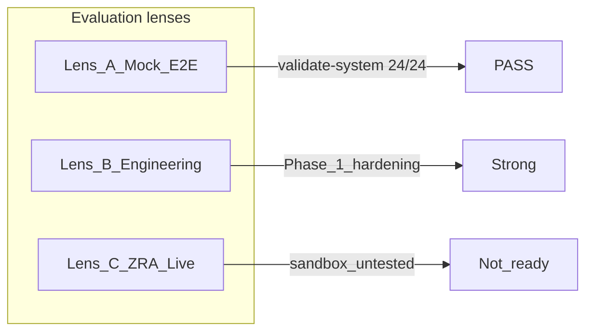

# SMARTPOS — Project Status

**Last updated:** 2026-06-25  
**Baseline commit:** `9915cb5` on `main`  
**Release tag:** `v0.4.0-refunds-mock` (functional baseline; Phase 1 engineering commits are on `main` after that tag)

**Positioning:** Mock-validated fiscal platform with known gaps for live ZRA.  
Do **not** claim "100% VSDC compliant" until live sandbox certification is complete.

---

## Three-lens scorecard

Use these lenses separately — do not mix them when reporting status.

| Lens | Verdict | Evidence |
|------|---------|----------|
| **A — Mock E2E** | PASS | `validate-system.js` → **24/24** against mock VSDC |
| **B — Engineering** | Strong | Phase 1 hardening: stock TOCTOU fix, fiscal reconciliation, gated `POST /api/sales`, branches API, `apiClient` consolidation |
| **C — ZRA Live** | Not ready | Real sandbox URL untested; purchases §8 missing; dashboard/reports still mock UI |



---

## What's implemented

### Fiscal checkout (primary POS path)

`POST /api/sales/checkout` via [`smart-pos-backend/lib/saleFiscal.js`](smart-pos-backend/lib/saleFiscal.js):

1. Stock + product-registration gates
2. Create `PENDING` sale
3. Reserve stock (`reservedStock` + row locks in [`inventoryStock.js`](smart-pos-backend/lib/inventoryStock.js))
4. Set status `FISCAL_SUBMITTING` → submit to VSDC
5. On success: deduct stock, store `rcptNo` / `qrCode`
6. On failure: release reservation, status `FISCAL_FAILED`

Bare `POST /api/sales` creates a gated pending sale only (no VSDC). Prefer `/checkout`.

### Refunds / credit notes

[`smart-pos-backend/lib/saleRefund.js`](smart-pos-backend/lib/saleRefund.js) — partial refunds with prorated discount, stock restore, VSDC credit-note submission.

### Fiscal reconciliation

[`smart-pos-backend/lib/fiscalReconcile.js`](smart-pos-backend/lib/fiscalReconcile.js) — recovers sales/refunds stuck in `FISCAL_SUBMITTING`. Scheduler runs every 5 minutes from `index.js`.

### Branches

Prisma `Branch` model, migration `20260626120000_branches`, [`routes/branches.js`](smart-pos-backend/routes/branches.js), default branch via [`ensureDefaultBranch.js`](smart-pos-backend/lib/ensureDefaultBranch.js).

### Sequential fiscal invoice numbers

[`smart-pos-backend/lib/fiscalInvoiceNumber.js`](smart-pos-backend/lib/fiscalInvoiceNumber.js) — sequential `fiscalInvcNo` per branch.

### Stock sync

[`stockSyncService.js`](smart-pos-backend/services/stockSyncService.js) — bulk adjust and mark-expired paths call `syncAfterMovements()`.

### Frontend API client

Single `apiFetch` in [`smart-pos-frontend/src/lib/apiClient.js`](smart-pos-frontend/src/lib/apiClient.js); axios removed.

### Auth & permissions

JWT login, role-based permissions on `GET /users/profile`, permission guards on routes.

### Stack

PostgreSQL (not SQLite), Express + Prisma backend, React frontend, mock VSDC on port 8090.

---

## Known gaps (Phase 2+)

| Gap | Notes |
|-----|-------|
| Live ZRA sandbox | `VSDC_URL` points at mock; no certification run |
| Purchases §8 | `routes/purchases.js` not implemented |
| Reports / dashboard | `ReportsPage.jsx` uses hardcoded mock data |
| Mandatory codes cache | Offline codes store not complete |
| Debit notes | Not implemented |
| B2B TPIN on sales | Walk-in default customer; explicit TPIN field TBD |
| Cancel / void flows | Limited |
| 5-year audit retention | Policy not enforced |

See [zra-compliance-checklist.md](smart-pos-backend/docs/zra-compliance-checklist.md) for requirement-level detail.

---

## How to validate

With containers running:

```bash
# Local dev
docker compose ps

# Numzlab
./scripts/compose-numzlab.sh ps

# End-to-end (24 checks)
docker exec smart-pos-backend node scripts/validate-system.js
```

Expected: **24/24 PASS** against mock VSDC.

Health checks:

```bash
curl -s http://localhost:4000/api/health
curl -s http://localhost:8090/health
```

---

## Roadmap

### Phase 2 (next)

1. ZRA sandbox URL + first live test
2. Purchases §8 (`routes/purchases.js`)
3. Dashboard/reports wired to real APIs

### Phase 3 (later)

Debit notes, B2B TPIN, cancel/void, mandatory codes cache, 5-year audit, certification sign-off.

---

## Documentation index

| Doc | Purpose |
|-----|---------|
| [README.md](README.md) | Numzlab deploy quick reference |
| [DEPLOY.md](DEPLOY.md) | Full deployment guide |
| [DEV_GUIDE.md](DEV_GUIDE.md) | Local development workflow |
| [ARCHITECTURE.md](smart-pos-backend/docs/ARCHITECTURE.md) | Backend flows and layering |
| [DATABASE.md](smart-pos-backend/docs/DATABASE.md) | Postgres setup and migrations |
| [zra-compliance-checklist.md](smart-pos-backend/docs/zra-compliance-checklist.md) | VSDC requirement checklist |
| [implementation-summary.md](smart-pos-backend/docs/implementation-summary.md) | Module map (canonical code locations) |

---

## Default login (seed users)

| Email | Password | Role |
|-------|----------|------|
| admin@smartpos.com | admin123 | ADMIN |
| cashier@smartpos.com | cashier123 | CASHIER |

Change passwords after first deploy. See [DEPLOY.md](DEPLOY.md) for full credentials context.
