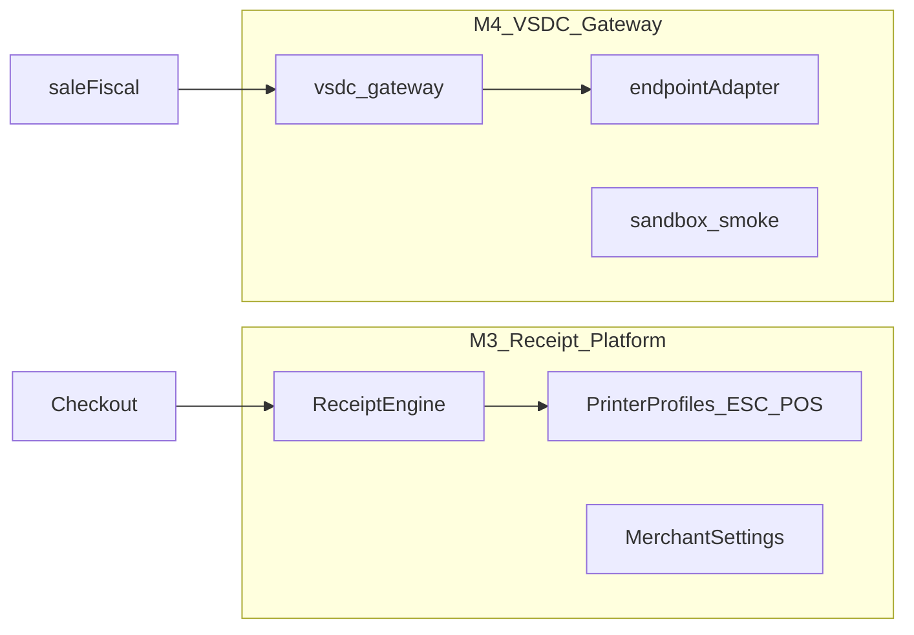

# SMARTPOS — Project Status

**Last updated:** 2026-07-01  
**Baseline:** Dual-track M3 (Receipt Platform) + M4 (VSDC Gateway) on `main`  
**Release tags (suggested):** `v0.6.0-receipt-platform` (M3), `v0.7.0-vsdc-gateway` (M4 after sandbox smoke)

**Positioning:** Mock-validated fiscal platform with receipt/print subsystem; VSDC gateway ready for sandbox UAT.  
Do **not** claim "100% VSDC compliant" until live sandbox certification is complete.

---

## Dual-track scorecard

| Milestone | Lens | Verdict | Evidence |
|-----------|------|---------|----------|
| **M3 — Receipt & Printing** | UI + receipt VM + print | **Shippable (mock)** | `@smartpos/receipt-engine`, thermal/A4 renderers, Merchant Settings, Printer Management, ESC/POS proxy |
| **M4 — ZRA Sandbox** | Official API paths + payloads | **Gateway ready; live UAT pending** | `lib/vsdc-gateway/`, mock dual paths, `sandbox-smoke.js` |
| **Mock E2E** | Full POS fiscal flow | **PASS** | `validate-system.js` → **26/26** against mock VSDC |
| **ZRA Live** | Sandbox certification | **Not ready** | Run `sandbox-smoke.js` with portal credentials |


```mermaid
flowchart LR
  subgraph m3 [M3_Receipt_Platform]
    RE[ReceiptEngine]
    PM[PrinterProfiles_ESC_POS]
    MS[MerchantSettings]
  end
  subgraph m4 [M4_VSDC_Gateway]
    GW[vsdc_gateway]
    EA[endpointAdapter]
    SM[sandbox_smoke]
  end
  Checkout --> RE
  RE --> PM
  saleFiscal --> GW --> EA
```

---

## Milestone 3 — Receipt and Printing Platform

| Deliverable | Status | Location |
|-------------|--------|----------|
| Receipt Engine package | Done | [`packages/receipt-engine/`](packages/receipt-engine/) |
| ReceiptViewModel + thermal/A4 renderers | Done | `ThermalRenderer`, `A4Renderer`, `ReceiptRenderer` |
| Merchant Settings (footer, logo URL, preview) | Done | [`SettingsPage.jsx`](smart-pos-frontend/src/pages/SettingsPage.jsx) |
| Receipt API + immutable snapshots | Done | [`routes/receipts.js`](smart-pos-backend/routes/receipts.js) |
| Checkout / Sales receipt UI | Done | [`CheckoutModal.jsx`](smart-pos-frontend/src/components/CheckoutModal.jsx), [`ReceiptViewModal.jsx`](smart-pos-frontend/src/components/receipt/ReceiptViewModal.jsx) |
| ESC/POS byte builder | Done | [`buildEscPos.ts`](packages/receipt-engine/src/escpos/buildEscPos.ts) |
| Printer profiles + API | Done | Prisma `PrinterProfile`, [`routes/printers.js`](smart-pos-backend/routes/printers.js) |
| Printer Management UI | Done | [`PrintersPage.jsx`](smart-pos-frontend/src/pages/PrintersPage.jsx) |
| StatusBar printer health | Done | [`CashierDashboard.jsx`](smart-pos-frontend/src/components/cashier/modern/CashierDashboard.jsx) polls `/api/settings/printers/status` |

**M3 exit:** Complete sale → on-screen receipt + browser or ESC/POS print; reprint audit; **no** changes to official `saveSales` in mock E2E.

---

## Milestone 4 — ZRA Sandbox Readiness

| Deliverable | Status | Location |
|-------------|--------|----------|
| VSDC Gateway layer | Done | [`lib/vsdc-gateway/`](smart-pos-backend/lib/vsdc-gateway/) |
| Endpoint adapter (`VSDC_MODE=mock\|official`) | Done | `endpointAdapter.js` |
| PDF-aligned `saveSales` builder + validator | Done | `payloadBuilders/saveSales.js`, `validators/saveSales.js` |
| `zraInvoice` → gateway facade | Done | [`zraInvoice.js`](smart-pos-backend/services/zraInvoice.js) |
| Codes sync (`/code/selectCodes`, `/itemClass/selectItemsClass`) | Done | `codesSync.js`, Prisma `ZraCode` / `ZraClassificationCode` |
| Mock dual paths | Done | [`mock-vsdc-server.js`](smart-pos-backend/mock-vsdc-server.js) |
| Admin codes sync | Done | `POST /api/vsdc/codes/sync` |
| Sandbox smoke script | Done | [`scripts/sandbox-smoke.js`](smart-pos-backend/scripts/sandbox-smoke.js) |

**Explicitly deferred (post-M4):** Imports, commercial/provisional invoices, purchases §5.11.

---

## What's implemented (core)

### Fiscal checkout

`POST /api/sales/checkout` via [`saleFiscal.js`](smart-pos-backend/lib/saleFiscal.js): stock gates → reserve → VSDC submit via gateway → deduct stock → receipt snapshot.

### Refunds / credit notes

[`saleRefund.js`](smart-pos-backend/lib/saleRefund.js) — partial refunds, stock restore, gateway credit-note shape.

### Stack

PostgreSQL, Express + Prisma, React frontend, mock VSDC on port 8090.

---

## How to validate

```bash
docker compose ps
docker exec smart-pos-backend node scripts/validate-system.js   # expect 26/26 PASS (mock)
```

Sandbox UAT (official credentials, not in repo):

```bash
VSDC_MODE=official VSDC_URL=... TPIN=... BHF_ID=... node smart-pos-backend/scripts/sandbox-smoke.js
```

See [DEPLOY.md](DEPLOY.md) § Sandbox UAT.

---

## Roadmap (post dual-track)

1. Live sandbox certification (`sandbox-smoke.js` green on ZRA UAT)
2. Item registration alignment (`/items/saveItem` hardening)
3. Purchases §8, imports, commercial/provisional invoices
4. Dashboard/reports wired to real APIs

---

## Documentation index

| Doc | Purpose |
|-----|---------|
| [README.md](README.md) | Numzlab deploy quick reference |
| [DEPLOY.md](DEPLOY.md) | Full deployment + sandbox prerequisites |
| [DEV_GUIDE.md](DEV_GUIDE.md) | Local development workflow |
| [ARCHITECTURE.md](smart-pos-backend/docs/ARCHITECTURE.md) | Backend flows and layering |
| [zra-compliance-checklist.md](smart-pos-backend/docs/zra-compliance-checklist.md) | Requirement-level ZRA status |
