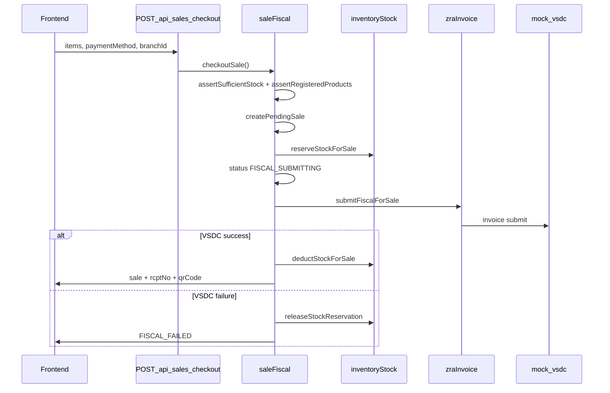

# Smart POS Backend — Architecture & Flows

## System context

```
smart-pos-frontend (:5173)
        │  JWT + REST
        ▼
smart-pos-backend (:4000)
        │
        ├── Prisma → PostgreSQL (self-hosted, see docs/DATABASE.md)
        └── vsdcService → VSDC / mock (:8090)
```

## Layering

| Layer | Location | Responsibility |
|-------|----------|----------------|
| Routes | `routes/*.js` | HTTP, auth guards, request validation |
| Services | `services/*.js` | ZRA/VSDC, audit, item/stock sync |
| Lib | `lib/*.js` | Prisma client, inventory helpers |
| Data | `prisma/schema.prisma` | Domain models |

## Authentication flow

1. `POST /api/users/login` — email + password → bcrypt compare → JWT (`JWT_SECRET`).
2. Protected routes send `Authorization: Bearer <token>`.
3. `middleware/auth.js` verifies JWT, loads user, attaches `permissions` by role.

Roles: `ADMIN` > `MANAGER` > `CASHIER` (see `PERMISSIONS` in auth middleware).

## Sale lifecycle (core POS)

Primary path: `POST /api/sales/checkout` → `lib/saleFiscal.checkoutSale()`.

Bare `POST /api/sales` creates a gated pending sale only (stock + registration gates, no VSDC). Use `/checkout` for the full fiscal-lock flow.



**Stock:** `lib/inventoryStock.js` reserves stock before VSDC submission and deducts only after confirmed success. Uses `SELECT FOR UPDATE` row locks and `reservedStock` per `productId` + `branchId` (default `main`).

**Tax on lines:** Uses each product’s `taxRate` (default 16%) to fill `splyAmt`, `taxblAmt`, `taxAmt`, `totAmt` on `SaleItem`.

**Reconciliation:** Sales stuck in `FISCAL_SUBMITTING` are recovered by `lib/fiscalReconcile.js` (scheduler in `index.js`, every 5 minutes).

## ZRA Smart Invoice flow

Checkout integrates VSDC submission inline via `zraInvoice.submitFiscalForSale()`. Legacy retry paths still exist for ops:

| Endpoint | Purpose |
|----------|---------|
| `POST /api/zra/send-invoice/:id` | Manual resubmit for `PENDING` / `FISCAL_FAILED` / `FISCAL_SUBMITTING` sales |
| `GET /api/zra/pending-sales` | Sales awaiting fiscal completion |
| `GET /api/zra/receipt-status/:saleId` | Receipt status lookup |

Refunds follow the same fiscal-lock pattern in `lib/saleRefund.js` (credit notes to VSDC, stock restore on success).

**Env:** Copy `.env.example` → `.env`. Run mock: `npm run mock-vsdc`.

## Inventory receive flow

`POST /api/inventory/receive` (in `routes/inventory/core.js`):

- Upserts `Inventory` for branch
- Creates `InventoryBatch` (optional expiry)
- Records `StockMovement` type `PURCHASE_IN`

## Data model highlights

- **Product** — catalog + ZRA classification fields (`zraItemClassification`, `taxType`, `taxRate`, units).
- **Sale / SaleItem** — transaction; line items carry VSDC monetary fields.
- **Inventory** — `currentStock` per product per branch (not on `Product`).
- **Invoice** — separate ZRA submission audit table (used by `submitInvoice` path).

## Compliance tooling

- [STATUS.md](../../STATUS.md) — three-lens project status (authoritative)
- `npm run compliance` — checklist runner
- `docs/implementation-summary.md` — module map
- `docs/zra-compliance-checklist.md` — VSDC requirements list

## Local development

```bash
cp .env.example .env
npm install
npm run db:up        # Postgres via Docker (or use your own server)
npm run setup-db
npm run mock-vsdc    # terminal 1
npm run dev          # terminal 2
```

Database details: [DATABASE.md](./DATABASE.md)

Default API: `http://localhost:4000/api/health`

## Known follow-ups

- Walk-in sales use default customer name; B2B sales may need explicit `customerTpin` on the sale model later.
- Purchases §8 (`routes/purchases.js`) not implemented.
- Dashboard/reports UI still uses hardcoded mock data.
- Live ZRA sandbox certification not yet run (`VSDC_URL` points at mock).
- Item registration is centralized in `lib/productRegistration.js` + `services/itemManagement.js`; `itemClassificationService` is a thin compatibility facade.
